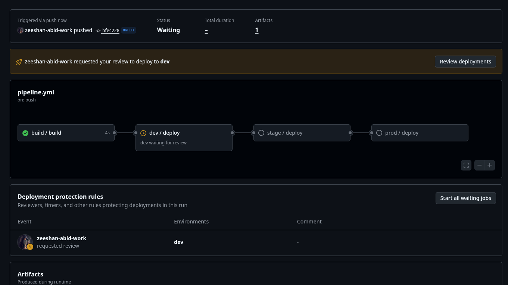
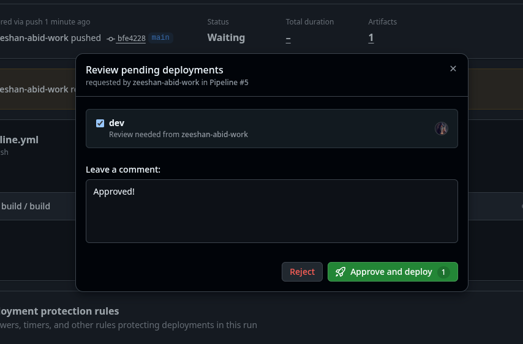
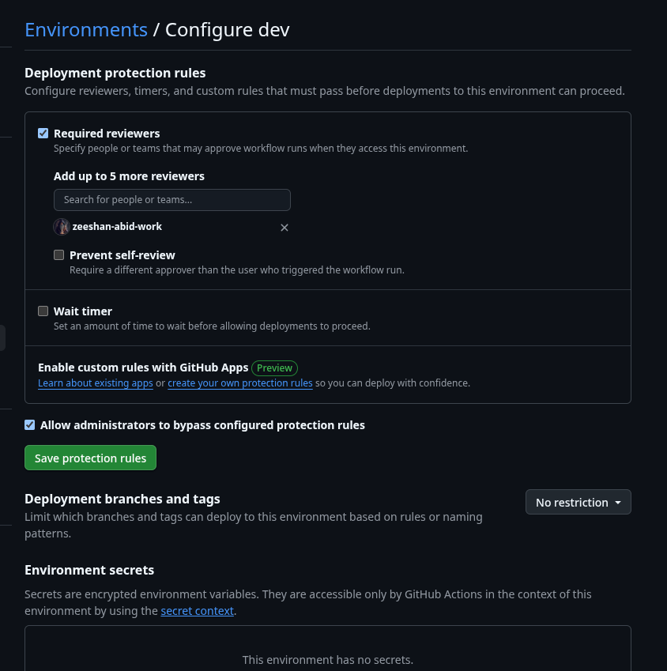

# Pipeline Example

This is an example of a Github Actions Multi-Staged pipeline.
This document describes the pipeline and how it works.

## Running the pipeline

The pipeline automatically triggers and does not need to be manually triggered.
If you wish to deploy a previous version, you can manually re-run the already completed pipeline.

## Reuseable workflow

There are 2 reuseable workflows in this pipeline:

- `build.yml`: This workflow is responsible for building the application.
- `deploy.yml`: This workflow is responsible for deploying the application.

## Tests, Lint and Build

This happens as part of the `build.yml` workflow. The app is tested and linted before being built. After it is built we save an artifact of the built app. So the EXACT same app is deployed to all environments.

## Deployment

Each deployment is targeted at a specific environment (e.g. `staging`, `production`).
With environment protection rules we can force a review before deploying to a specific environment.





Once the review is <b>approved</b> the deployment will proceed automatically.

We will also restrict deployment by checking the branch name.

```yaml
if: github.ref == 'refs/heads/main'
# or
if: startsWith(github.ref, 'refs/tags/v')
```

The above lines ensure the correct branch or tag is specified before deployment can continue for the specific environment. Otherwise deployment is automatically skipped since it fails the check.

Lastly you can configure specific environment secrets and variables in the settings for each environment.


